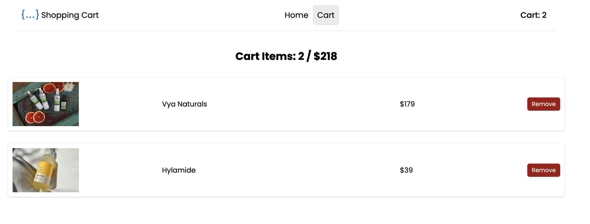

# Shopmate (REACTJS - Redux)

### Screenshot:

## Overview:

This project utilizes Redux for global state management, providing a predictable state container for JavaScript applications. Redux helps to centralize application state and logic, enabling easier debugging and testing.

### Key Features:

- Redux: A state management library that allows you to manage the application state globally, making it accessible to all components without prop drilling.

- Actions: Plain JavaScript objects that describe the intention to change the state. Each action must have a type property that indicates the action type.

- Reducers: Pure functions that take the previous state and an action as arguments and return a new state. They are used to specify how the application state changes in response to actions.

- Store: The central repository for the application's state. The store holds the complete state tree of your application.

- Dispatch: A method used to send actions to the store, allowing you to trigger state updates.

- Middleware: Enhance Redux with custom logic before the action reaches the reducer, enabling functionalities like logging, crash reporting, or asynchronous op erations.

Installation:
Clone the repository:

bash
Copy code
git clone https://github.com/yourusername/shopmate-redux.git
cd shopmate-redux
Install the dependencies:

bash
Copy code
npm install
Start the application:

bash
Copy code
npm start
Usage:
After starting the application, you can navigate through the Shopmate eCommerce platform, add items to the cart, and observe how the global state is managed using Redux.
